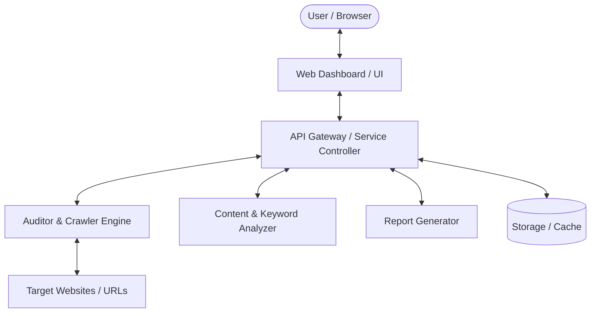

# System Architecture

## 1. Overview
The SEO platform is engineered to deliver fast, modular, and in-depth SEO analysis for target websites and digital properties.

---

## 2. Core Modules

### 2.1 Crawler & Auditor Service
- **HTML Parser:** Extracts DOM structure, metadata (`<title>`, `<meta>`, OpenGraph, Twitter, canonical, hreflang, robots).
- **Asset Inspector:** Images without alt attributes, oversized assets, render-blocking resources.
- **Link Validator:** Internal vs. external link crawler, anchor text verification, 4xx/5xx status code detection.
- **Structured Data Validator:** JSON-LD, Microdata, RDFa schema extraction and syntax validation.

### 2.2 Content & Semantic Engine
- **Keyword & Density Analyzer:** Computes 1-gram, 2-gram, 3-gram frequencies and search relevance.
- **Heading Hierarchy:** Enforces single `<h1>` hierarchy, detects missing headings, checks heading keyword presence.
- **Readability & Sentiment:** Flesch-Kincaid / Gunning-Fog readability scoring.

### 2.3 Dashboard & Reporting Layer
- **Live Interactive UI:** Real-time score meters, issue severity categorization (Critical, Warning, Passed).
- **Actionable Task List:** Step-by-step resolution advice for each detected issue.
- **Exporting:** Downloadable audit summaries in JSON/HTML/PDF.

---

## 3. Data Flow & Security
- **Input Sanitization:** URL protocol enforcement (`http://`, `https://`), domain whitelisting/rate limiting.
- **Non-blocking Execution:** Async scanning with real-time status updates.
- **Data Privacy:** Localized caching to preserve audit history without leaking confidential data.
